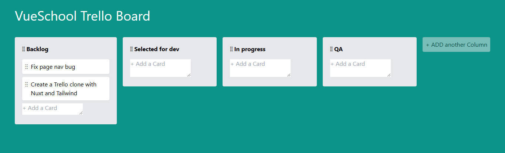
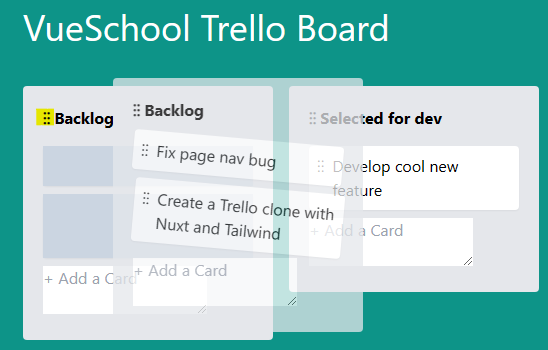
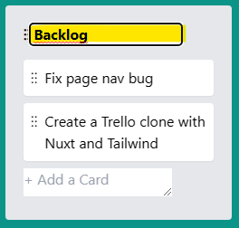
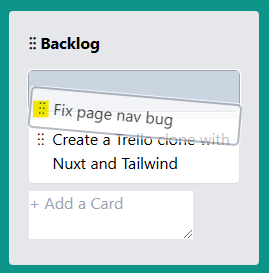

# Vueschool Trello Clone

Esse projeto é um clone do site Trello, foi feito durante a Vue School free weekend.

<p align="center">
  
</p>

## 🚀 Tecnologias

- [Nuxt](https://nuxt.com/)
- [Typescript](https://www.typescriptlang.org/)
- [HTML](https://developer.mozilla.org/pt-BR/docs/Web/HTML)
- [Tailwind](https://tailwindcss.com/)

### Features

* É possível arrastar uma coluna para outra e susbituir a posição da coluna que esta naquela posição. Para fazer isso, vá com o mouse até onde está marcado em amarelo no print.

<p align="center">
  
</p>

* Para acrescentar uma coluna, clique em ADD another column, digite o nome da coluna e confirme com a tecla ENTER. A coluna será adicionada.

* Para deletar uma coluna, clique no nome e apague todo conteudo. A coluna será deletada.

* Para editar o nome da coluna, clique no seu nome, digite o novo nome e confirme com a tecla ENTER.
<p align="center">
  
</p>

* Para acrescentar uma tarefa, clique em Add a card, digite o nome da tarefa e confirme com a tecla TAB. Uma nova tarefa será adicionada na coluna.

* Também é possível movimentar a ordem das tarefas dentro da coluna.

<p align="center">
  
</p>


* Para deletar uma tarefa, clique na tarefa desejada, pressione a tecla Backspace. A tarefa será apagada.

## 💻 Como executar o projeto

Para executar o projeto em sua máquina, siga os seguintes passos:

Faça um clone deste repositório em sua máquina:

```
git clone https://github.com/euheber/trelloclone.git
```

Acesse o diretório e instale as dependências do projeto:
```
npm install
```

Para abrir o projeto no navegador utilize o comando: 
```
npm run dev
```

Lembre-se de que é necessário ter o Node.js e o npm instalados em sua máquina. Se você ainda não os possui, faça o download em [Node](https://nodejs.org/).